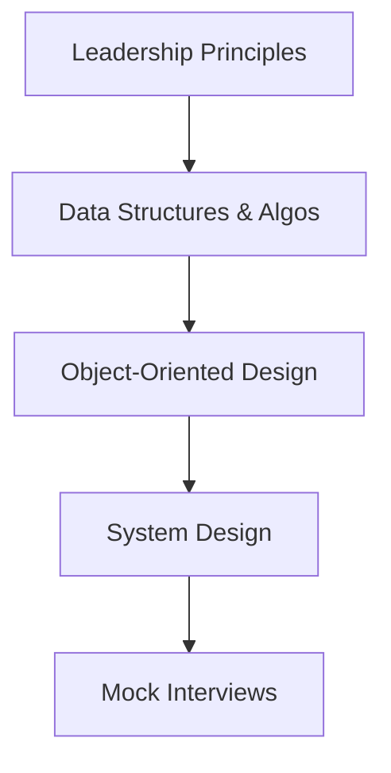

# Amazon Interview Preparation Roadmap

### Phase 1: Leadership Principles & Behavioral (Week 1)
- Write 2 stories for each Leadership Principle.
- Refine stories using the STAR format. Highlight data metrics.

### Phase 2: Technical DSA & OOD (Week 2-3)
- Focus on Trees, Graphs, BFS/DFS, Dynamic Programming.
- Practice Object-Oriented Design (e.g. Design Parking Lot, Movie Booking).

### Phase 3: High-Level System Design (Week 4)
- Study rate limiters, key-value stores, distributed messaging, and CDNs.
