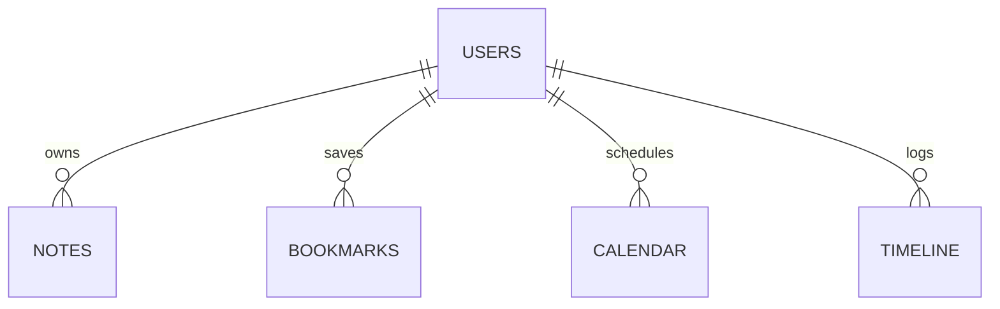

# JavaMentor — Database & Cache Storage Guide

This document catalogs the Firestore collection rules, IndexedDB v7 schema boundaries, and LocalStorage properties.

---

## 1. Cloud Firestore Schema

Firestore documents are placed under subcollections of the user root document to guarantee complete data isolation:

```
/users/{userId}
   ├── /notes/{noteId}
   ├── /bookmarks/{bookmarkId}
   ├── /calendar/{taskId}
   ├── /timeline/{eventId}
   ├── /progress/mastery
```

### Collection Paths & Structures:

#### A. Users Path: `/users/{userId}`
- **Fields**:
  - `uid`: `string` (Primary User ID)
  - `email`: `string`
  - `displayName`: `string`
  - `createdAt`: `timestamp`

#### B. Notes Path: `/users/{userId}/notes/{noteId}`
- **Fields**:
  - `id`: `string`
  - `title`: `string`
  - `content`: `string` (Markdown value)
  - `userId`: `string`
  - `isHighlight`: `boolean`
  - `targetType`: `string` (e.g. `'lesson'`)
  - `targetId`: `string`

#### Firestore Entity-Relationship Diagram:


---

## 2. IndexedDB Schema (v7)

IndexedDB contains objects scoped under user keys (`uid_id`) to ensure isolation when switching accounts:

| Object Store | Key Path | Description |
| ------------ | -------- | ----------- |
| `notes` | Out-of-line (`uid_noteId`) | Locally written notes and lesson highlights. |
| `bookmarks` | Out-of-line (`uid_bookmarkId`) | Saved coding tasks and lesson references. |
| `calendar` | Out-of-line (`uid_taskId`) | Planners and milestones deadlines. |
| `timeline` | Out-of-line (`uid_eventId`) | Study activities timeline. |

### Range Cursors
Queries targeting individual users perform prefix scans:
```javascript
const range = IDBKeyRange.bound(`${uid}_`, `${uid}_\uffff`);
```

---

## 3. LocalStorage Keys

LocalStorage is reserved for lightweight preferences:

- `theme`: `'light' | 'dark'` — Selected display color preference.
- `assistant_pref_${uid}`: JSON object mapping user dialogue preferences.
- `last_page_visited`: Navigation tracking fallback.
