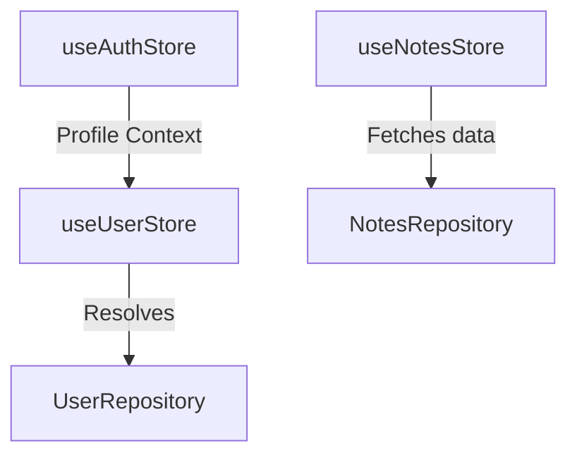
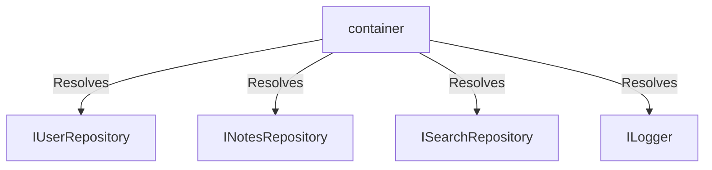

# DevMentor AI — State & Dependency Injection Manual

This guide documents the Zustand stores, state actions, persistence rules, and the Dependency Injection configuration.

---

## 1. Zustand State Stores

### A. Auth Store (`useAuthStore.js`)
- **State**: `user` object, `profile` database copy, `isLoading` loading status.
- **Actions**:
  - `signIn(email, password)`: Authenticates credentials.
  - `signUp(email, password, name)`: Creates credentials and default profile.
  - `signOut()`: Clears active session.
  - `setProfile(profile)`: Syncs user meta.
- **Reset Logic**: Triggers `GlobalStateResetService.js` to clear IndexedDB range keys, cancel active debounce timers, and scrub Zustand store instances.

### B. Notes Store (`useNotesStore.js`)
- **State**: `notes` array, `activeNote` note, `isLoading` loading status.
- **Actions**:
  - `loadNotes(uid)`: Fetches cached notes from `NotesRepository`.
  - `saveNote(uid, note)`: Puts note into local cache and queue.
  - `deleteNote(uid, id)`: Marks note deleted and enqueues sync request.

### C. Store Dependencies Diagram

---

## 2. Dependency Injection Container

All repository classes are resolved at runtime through `/src/infrastructure/di/container.js`.

### Container Registrations:
- `environment` ➔ Development / Production variables configuration.
- `ILogger` ➔ Structured Console Logger instance.
- `INotesRepository` ➔ `NotesRepository` implementation.
- `IBookmarkRepository` ➔ `BookmarkRepository`.
- `ICalendarRepository` ➔ `CalendarRepository`.
- `ITimelineRepository` ➔ `TimelineRepository`.
- `IAchievementRepository` ➔ `AchievementRepository`.
- `IUserRepository` ➔ `FirestoreUserRepository`.

### Dependency Graph:

