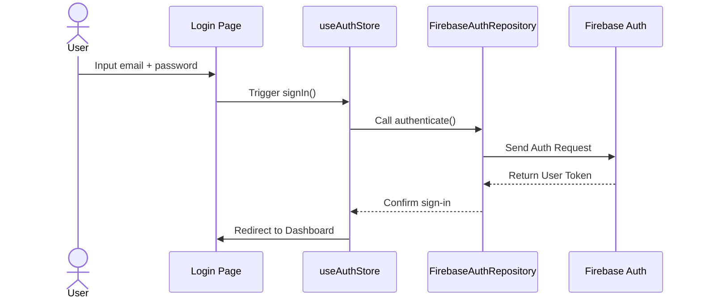
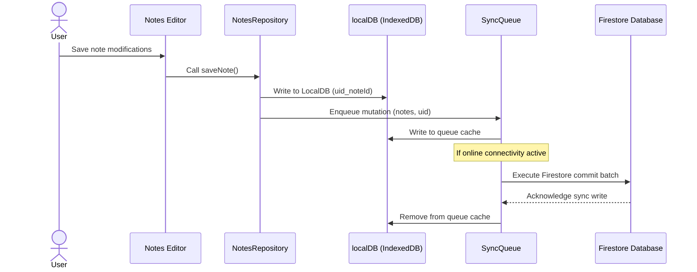

# DevMentor AI — Workspace Structure & System Flow Diagrams

This guide documents the folder layout, user authentication flows, and data interaction sequence loops.

---

## 1. Directory Tree & Folder Structure

```
/
├── .github/workflows/      # GitHub Actions CI pipeline configs
├── content/                # Course curriculum markdown, quizzes, flashcards JSONs
├── docs/                   # System manuals, showcase case studies, resume guides
├── public/                 # Static PWA icons and generated content registry index files
├── scripts/                # content validator and registry generation scripts
├── src/                    # Core source code
│   ├── application/        # Application Use Cases
│   ├── domain/             # Entities, Models, and Repository interfaces
│   ├── infrastructure/     # Database classes, DI container, config files
│   └── presentation/       # UI Components, pages, routing, Zustand state stores
└── tailwind.config.js      # Global layout styles config
```

---

## 2. Sequence Diagrams

### A. Authentication & User Login Sequence


### B. Offline Cache & Sync Queue Sequence

