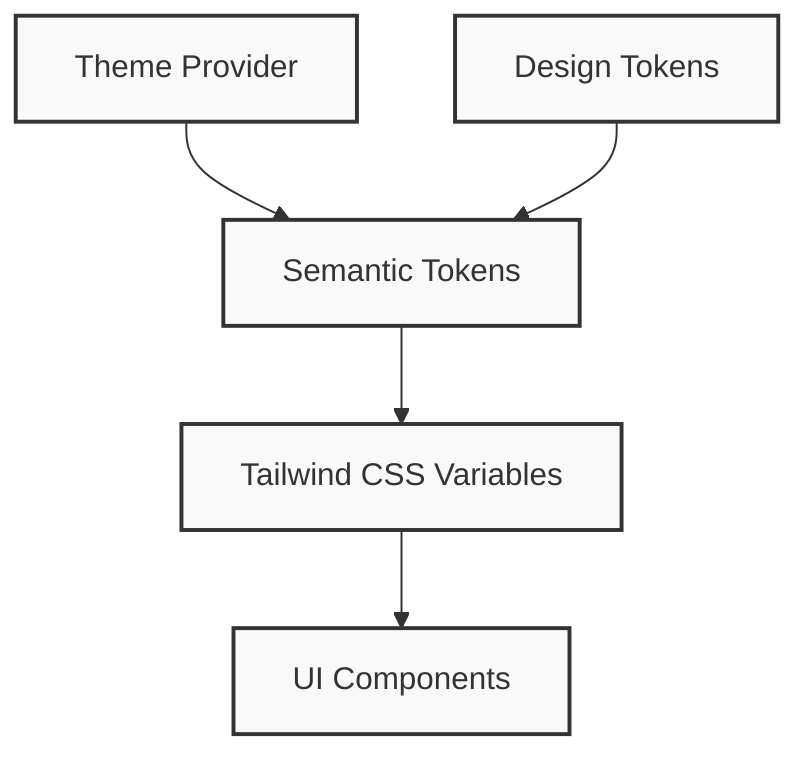

# JavaMentor Design System: Theme & Color System

## 1. Introduction

Welcome to the official developer documentation for the **JavaMentor Design System**, focusing on our robust Theme and Color System. This document serves as the single source of truth for understanding, implementing, and maintaining colors across our application in both Light and Dark modes.

### Design Philosophy

At JavaMentor, our design philosophy is rooted in creating a seamless, intuitive, and accessible user experience. We prioritize semantic meaning over literal values, allowing our UI to adapt dynamically to user preferences. Hardcoded colors are strictly forbidden.

### Accessibility Goals

Our color system is rigorously tested to ensure it meets or exceeds **WCAG 2.1 AA** standards for color contrast.

---

## 2. Theme Architecture

The JavaMentor Theme Architecture transforms abstract design decisions into concrete UI components.

### The Token Hierarchy

1. **Theme Provider:** The state that toggles the `.dark` class on the `html` root.
2. **Design Tokens:** The literal values of our palette.
3. **Semantic Tokens:** Variables that assign meaning (`--color-surface`, `--color-primary`).
4. **Tailwind Variables:** Exposed custom properties mapping semantic tokens to utility classes (`bg-surface`).
5. **Components:** UI elements styled using only semantic Tailwind classes.



---

## 3. Semantic Tokens & Palettes

We define these in `src/index.css`.

### Backgrounds & Surfaces
- `bg-background`: The main app background. Light: white, Dark: deep navy (`slate-950`).
- `bg-surface`: Primary card and panel backgrounds.
- `bg-surface-secondary`: Sidebar, alternate panels, hover states.
- `bg-surface-tertiary`: Tertiary elements, deep backgrounds.

### Text & Content
- `text-primary`: Primary reading text. Light: almost black, Dark: almost white.
- `text-secondary`: Supporting text.
- `text-muted`: De-emphasized text.
- `text-disabled`: Inactive text.

### Borders
- `border-default`: Standard dividing lines.
- `border-muted`: Subtle dividers.
- `border-active`: Focused or highlighted borders.

---

## 4. Tailwind Integration & Component Mapping

Our `tailwind.config.js` maps `bg-surface` to `rgb(var(--color-surface) / <alpha-value>)`.

### Component Mapping Best Practices

| Element Type | Background | Border | Text |
|--------------|------------|--------|------|
| App Root     | `bg-background` | - | `text-primary` |
| Main Card    | `bg-surface` | `border-default` | `text-primary` |
| Secondary Card | `bg-surface-secondary` | `border-muted` | `text-secondary` |
| Code Block | `bg-surface-tertiary` | `border-default` | `text-muted` |

---

## 5. Developer Guidelines & Migration Guide

### 🚫 Forbidden Practices

Never use hardcoded colors inside components:
```jsx
// ❌ WRONG
<div className="bg-slate-900 text-white border-gray-700 shadow-black/10">

// ❌ WRONG
<div style={{ color: "#ffffff" }}>
```

### ✅ Correct Usage

Always use semantic design tokens:
```jsx
// ✅ CORRECT
<div className="bg-surface-secondary text-primary border-default shadow-md">
```

### Theme Linter

We enforce these rules via a custom Theme Linter (`scripts/theme-linter.cjs`).
Running `npm run lint` will parse your React components and fail the build if any forbidden classes (like `bg-gray-*` or `text-white`) are detected.

### Migration Summary

As part of the Enterprise Theme Audit, over 270 files were migrated.
- Hardcoded `bg-slate-900` was remapped to `bg-surface-secondary` or `bg-card`.
- Hardcoded `text-slate-400` was remapped to `text-muted`.
- Charts and Monaco Editor were updated to respect the current theme state rather than forcing a dark mode UI globally.

Ensure you consult this document when building new components to maintain our design system integrity!
